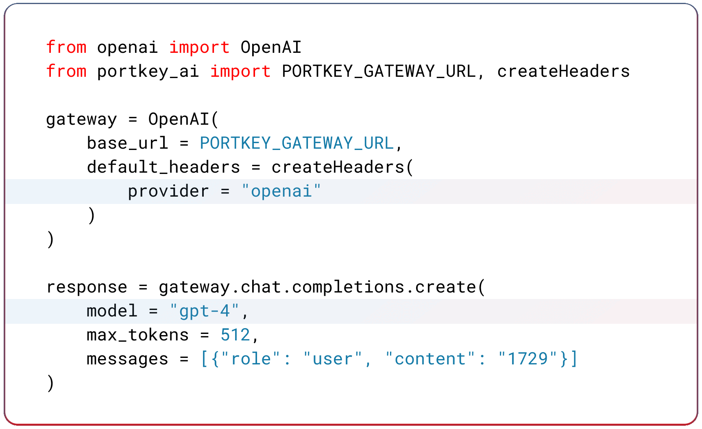

<div align="center">

<p align="right">
   <strong>English</strong> | <a href="./.github/README.cn.md">中文</a> 
</p>


# AI Gateway
#### Reliably route to 200+ LLMs with 1 fast & friendly API
<br>

[](./LICENSE)
[](https://portkey.ai/community)
[](https://twitter.com/portkeyai)
[](https://www.npmjs.com/package/@portkey-ai/gateway)
[](https://status.portkey.ai/?utm_source=status_badge)

</div>

The [AI Gateway](https://portkey.ai/features/ai-gateway) streamlines requests to 250+ language, vision, audio and image models with a unified API. It is production-ready with support for caching, fallbacks, retries, timeouts, loadbalancing, and can be edge-deployed for minimum latency.

✅&nbsp; **Blazing fast** (9.9x faster) with a **tiny footprint** (~100kb build) <br>
✅&nbsp; **Load balance** across multiple models, providers, and keys <br>
✅&nbsp; **Fallbacks** make sure your app stays resilient <br>
✅&nbsp; **Automatic Retries** with exponential fallbacks come by default <br>
✅&nbsp; **Configurable Request Timeouts** to easily handle unresponsive LLM requests <br>
✅&nbsp; **Multimodal** to support routing between Vision, TTS, STT, Image Gen, and more models <br>
✅&nbsp; **Plug-in** middleware as needed <br>
✅&nbsp; Battle tested over **480B tokens** <br>
✅&nbsp; **Enterprise-ready** for enhanced security, scale, and custom deployments <br>
<br>
## Setup & Installation
Use the AI gateway through the **hosted API** or **self-host** the open-source or enterprise versions on your environment.
<br>

#### 👉 Hosted Gateway on portkey.ai (Fastest)
The hosted API is the fastest way to setup an AI Gateway for your Gen AI application. We process **billions of tokens** daily and is in production with companies like Postman, Haptik, Turing, MultiOn, SiteGPT, and more.

<a href="https://app.portkey.ai/signup"></a><br>
<br>

#### 👉 Self-hosting the OSS version ([MIT License](https://github.com/Portkey-AI/gateway?tab=MIT-1-ov-file#readme))

To run the AI gateway locally, execute the following command in your terminal. (Needs npx installed) Or, explore deployment guides for [Cloudflare](https://github.com/Portkey-AI/gateway/blob/main/docs/installation-deployments.md#cloudflare-workers), [Docker](https://github.com/Portkey-AI/gateway/blob/main/docs/installation-deployments.md#docker), [Node.js](https://github.com/Portkey-AI/gateway/blob/main/docs/installation-deployments.md#nodejs-server) and more [here](#deploying-the-ai-gateway).
```bash
npx @portkey-ai/gateway
```
<sup>Your AI Gateway is now running on http://localhost:8787 🚀</sup>
<br>

#### 👉 Self-hosting the Enterprise Version
The AI Gateway's enterprise version offers enterprise-ready capabilities for **org management**, **governance**, **security** and [more](https://docs.portkey.ai/docs/product/enterprise-offering) out of the box. Compare the open source, hosted and enterprise versions here.

The enterprise deployment architecture, supported platforms is available here - [**Enterprise Private Cloud Deployments**](https://docs.portkey.ai/docs/product/enterprise-offering/private-cloud-deployments)

<a href="https://app.portkey.ai/signup"></a><br>

<br>

## Making requests through the AI gateway

####  Compatible with OpenAI API & SDKs

The AI Gateway is compatible with the OpenAI API & SDKs, and extends them to call 200+ LLMs reliably.  To use the Gateway through OpenAI, **update the client** to include the gateway's URL and headers and make requests as usual. The AI gateway can translate requests written in the OpenAI format to the signature expected by the specified provider. [View examples](https://docs.portkey.ai/docs/guides/getting-started/getting-started-with-ai-gateway)
<br><br>

####  Using the Python SDK &nbsp;&nbsp;<a href="https://colab.research.google.com/drive/1hLvoq_VdGlJ_92sPPiwTznSra5Py0FuW?usp=sharing"></a>
[Portkey Python SDK](https://github.com/Portkey-AI/portkey-python-sdk) is a wrapper over the OpenAI Python SDK with added support for additional parameters across all other providers. **If you're building with Python, this is the recommended library** to connect to the Gateway.
```bash
pip install -qU portkey-ai
```
<br>


####  Using the Node.JS SDK
[Portkey JS/TS SDK](https://www.npmjs.com/package/portkey-ai) is a wrapper over the OpenAI JS SDK with added support for additional parameters across all other providers. **If you're building with JS or TS, this is the recommended library** to connect to the Gateway.

```bash
npm install --save portkey-ai
```
<br>


####  Using the REST APIs
The AI gateway supports OpenAI compatible endpoints with added parameter support for all other providers and models. [View API Reference](https://docs.portkey.ai/docs/api-reference/introduction).
<br><br>

#### Other Integrations

| Language          | Supported SDKs                                                                                                                                                                                                                                                                                                  |
| ----------------- | --------------------------------------------------------------------------------------------------------------------------------------------------------------------------------------------------------------------------------------------------------------------------------------------------------------- |
| JS / TS |  [LangchainJS](https://www.npmjs.com/package/langchain) <br> [LlamaIndex.TS](https://www.npmjs.com/package/llamaindex)                                                                      |
| Python            | <br> [Langchain](https://portkey.ai/docs/welcome/integration-guides/langchain-python) <br> [LlamaIndex](https://portkey.ai/docs/welcome/integration-guides/llama-index-python) |
| Go                | [go-openai](https://github.com/sashabaranov/go-openai)                                                                                                                                                                                                                                                          |
| Java              | [openai-java](https://github.com/TheoKanning/openai-java)                                                                                                                                                                                                                                                       |
| Rust              | [async-openai](https://docs.rs/async-openai/latest/async_openai/)                                                                                                                                                                                                                                               |
| Ruby              | [ruby-openai](https://github.com/alexrudall/ruby-openai)                                                                                                                                                                                                                                                        |
<br>


## Gateway Cookbooks

### 📈 Trending Cookbooks
* [Run Gateway on prompts from Langchain hub](/cookbook/use-cases/run-gateway-on-prompts-from-langchain-hub.md)
* [Use Porkey Gateway with Vercel's AI SDK](/cookbook/integrations/vercel-ai.md)
* [Set up fallback from SDXL to Dall-E-3](/cookbook/getting-started/fallback-from-stable-diffusion-to-dall-e.ipynb)

### ✨ Latest Cookbooks
* [Comparing Top 10 LMSYS Models with Portkey](/cookbook/use-cases/LMSYS%20Series/comparing-top10-LMSYS-models-with-Portkey.ipynb)
* [Fallback from OpenAI to Azure OpenAI](/cookbook/getting-started/fallback-from-openai-to-azure.ipynb)
* [Set up automatic retries for failed requests](/cookbook/getting-started/automatic-retries-on-failures.md)
* [Call Llama 3 on Groq](/cookbook/use-cases/llama-3-on-groq.ipynb)

### [More Examples](https://github.com/Portkey-AI/gateway/tree/main/cookbook)

## Supported Providers

Explore Gateway integrations with [25+ providers](https://portkey.ai/docs/welcome/integration-guides) and [6+ frameworks](https://portkey.ai/docs/welcome/integration-guides).

|                                                                                                                            | Provider                                                                                      | Support | Stream |
| -------------------------------------------------------------------------------------------------------------------------- | --------------------------------------------------------------------------------------------- | ------- | ------ |
|                                                                               | [OpenAI](https://portkey.ai/docs/welcome/integration-guides/openai)                           | ✅       | ✅      |
|                                                                                  | [Azure OpenAI](https://portkey.ai/docs/welcome/integration-guides/azure-openai)               | ✅       | ✅      |
|                                                                               | [Anyscale](https://portkey.ai/docs/welcome/integration-guides/anyscale-llama2-mistral-zephyr) | ✅       | ✅      |
|                            | [Google Gemini & Palm](https://portkey.ai/docs/welcome/integration-guides/gemini)             | ✅       | ✅      |
|                                                                              | [Anthropic](https://portkey.ai/docs/welcome/integration-guides/anthropic)                     | ✅       | ✅      |
|                                                                                 | [Cohere](https://portkey.ai/docs/welcome/integration-guides/cohere)                           | ✅       | ✅      |
|  | [Together AI](https://portkey.ai/docs/welcome/integration-guides/together-ai)                 | ✅       | ✅      |
|                                                                  | [Perplexity](https://portkey.ai/docs/welcome/integration-guides/perplexity-ai)                | ✅       | ✅      |
|                                                                | [Mistral](https://portkey.ai/docs/welcome/integration-guides/mistral-ai)                      | ✅       | ✅      |
|                                                               | [Nomic](https://portkey.ai/docs/welcome/integration-guides/nomic)                             | ✅       | ✅      |
|                                               | [AI21](https://portkey.ai/docs/welcome/integration-guides)                                    | ✅       | ✅      |
|                                                    | [Stability AI](https://portkey.ai/docs/welcome/integration-guides/stability-ai)               | ✅       | ✅      |
|                                             | [DeepInfra](https://portkey.ai/docs/welcome/integration-guides)                               | ✅       | ✅      |
|                                                                   | [Ollama](https://portkey.ai/docs/welcome/integration-guides/ollama)                           | ✅       | ✅      |
|                                                                          | Novita AI                                                                                     | ✅       | ✅      | `/chat/completions`, `/completions` |

> [View the complete list of 200+ supported models here](https://portkey.ai/docs/welcome/what-is-portkey#ai-providers-supported)
<br>

<br>

## Agents
Gateway seamlessly integrates with popular agent frameworks. [Read the documentation here](https://docs.portkey.ai/docs/welcome/agents).  


| Framework | Call 200+ LLMs | Advanced Routing | Caching | Logging & Tracing* | Observability* | Prompt Management* |
|------------------------------|--------|-------------|---------|------|---------------|-------------------|
| [Autogen](https://docs.portkey.ai/docs/welcome/agents/autogen)    | ✅     | ✅          | ✅      | ✅   | ✅            | ✅                |
| [CrewAI](https://docs.portkey.ai/docs/welcome/agents/crewai)             | ✅     | ✅          | ✅      | ✅   | ✅            | ✅                |
| [LangChain](https://docs.portkey.ai/docs/welcome/agents/langchain-agents)             | ✅     | ✅          | ✅      | ✅   | ✅            | ✅                |
| [Phidata](https://docs.portkey.ai/docs/welcome/agents/phidata)             | ✅     | ✅          | ✅      | ✅   | ✅            | ✅                |
| [Llama Index](https://docs.portkey.ai/docs/welcome/agents/llama-agents)             | ✅     | ✅          | ✅      | ✅   | ✅            | ✅                |
| [Control Flow](https://docs.portkey.ai/docs/welcome/agents/control-flow) | ✅     | ✅          | ✅      | ✅   | ✅            | ✅                |
| [Build Your Own Agents](https://docs.portkey.ai/docs/welcome/agents/bring-your-own-agents) | ✅     | ✅          | ✅      | ✅   | ✅            | ✅                |

<br>

*Only available on the [hosted app](https://portkey.ai). For detailed documentation [click here](https://docs.portkey.ai/docs/welcome/agents). 


## Features

<table width=100%>
  <tr>
    <td width="50%">
      <strong><a href="https://portkey.ai/docs/product/ai-gateway-streamline-llm-integrations/fallbacks">Fallbacks</a></strong><br/>
      Fallback to another provider or model on failed requests. You can specify the errors on which to trigger the fallback. Improves reliability of your application
      <br><br>
      
    </td>
    <td width="50%">
      <strong><a href="https://portkey.ai/docs/product/ai-gateway-streamline-llm-integrations/automatic-retries">Automatic Retries</a></strong><br/>
      Automatically retry failed requests up to 5 times. An exponential backoff strategy spaces out retry attempts to prevent network overload.
      <br><br>
      
    </td>
  </tr>
  
</table>
<table width="100%">
  <tr>
    <td width="50%"> 
      <strong><a href="https://portkey.ai/docs/product/ai-gateway-streamline-llm-integrations/load-balancing">Load Balancing</a></strong><br/>
      Distribute LLM requests across multiple API keys or AI providers with weights to ensure high availability and optimal performance.
      <br><br>
      
    </td>
    <td width="50%">
      <strong><a href="https://portkey.ai/docs/product/ai-gateway-streamline-llm-integrations/request-timeouts">Request Timeouts</a></strong></br><br/>
      Manage unruly LLMs & latencies by setting up granular request timeouts, allowing automatic termination of requests that exceed a specified duration.
      <br><br>
      
    </td>
  </tr>
</table>

</table>
<table width="100%">
  <tr>
    <td width="50%"> 
      <strong><a href="https://docs.portkey.ai/docs/product/ai-gateway-streamline-llm-integrations/multimodal-capabilities">Multi-modal LLM Gateway</a></strong><br/>
      Call vision, audio (text-to-speech & speech-to-text), and image generation models from multiple providers  — all using the familiar OpenAI signature
      <br><br>
      
    </td>
    <td width="50%">
      <strong><a href="https://docs.portkey.ai/docs/product/guardrails">Guardrails</a></strong></br><br/>
      Verify your LLM inputs AND outputs to adhere to your specified checks. Build your own checks or choose from the 20+ pre-built guardrails.
      <br><br>
      
    </td>
  </tr>
</table>

**These features are configured through the Gateway Config added to the  `x-portkey-config` header or the `config` parameter in the SDKs.**

Here's a sample config JSON showcasing the above features. All the features are optional

```json
{
	"retry": { "attempts": 5 },
	"request_timeout": 10000,
	"strategy": { "mode": "fallback" }, // or 'loadbalance', etc
	"targets": [{
		"provider": "openai",
		"api_key": "sk-***"
	},{
		"strategy": {"mode": "loadbalance"}, // Optional nesting
		"targets": {...}
	}]
}
```

Then use the config in your API requests to the gateway.


### Using Gateway Configs

Here's a guide to [use the config object in your request](https://portkey.ai/docs/api-reference/config-object).

<br>


## Gateway Enterprise Version
Make your AI app more <ins>reliable</ins> and <ins>forward compatible</ins>, while ensuring complete <ins>data security</ins> and <ins>privacy</ins>.

✅&nbsp; Secure Key Management - for role-based access control and tracking <br>
✅&nbsp; Simple & Semantic Caching - to serve repeat queries faster & save costs <br>
✅&nbsp; Access Control & Inbound Rules - to control which IPs and Geos can connect to your deployments <br>
✅&nbsp; PII Redaction - to automatically remove sensitive data from your requests to prevent indavertent exposure <br>
✅&nbsp; SOC2, ISO, HIPAA, GDPR Compliances - for best security practices <br>
✅&nbsp; Professional Support - along with feature prioritization <br>

[Schedule a call to discuss enterprise deployments](https://calendly.com/rohit-portkey/noam)

<br>


## Contributing

The easiest way to contribute is to pick an issue with the `good first issue` tag 💪. Read the contribution guidelines [here](/.github/CONTRIBUTING.md).

Bug Report? [File here](https://github.com/Portkey-AI/gateway/issues) | Feature Request? [File here](https://github.com/Portkey-AI/gateway/issues)

<br>

## Community

Join our growing community around the world, for help, ideas, and discussions on AI.

- View our official [Blog](https://portkey.ai/blog)
- Chat with us on [Discord](https://portkey.ai/community)
- Follow us on [Twitter](https://twitter.com/PortkeyAI)
- Connect with us on [LinkedIn](https://www.linkedin.com/company/portkey-ai/)
<!-- - Visit us on [YouTube](https://www.youtube.com/channel/UCZph50gLNXAh1DpmeX8sBdw) -->
<!-- - Join our [Dev community](https://dev.to/portkeyai) -->
<!-- - Questions tagged #portkey on [Stack Overflow](https://stackoverflow.com/questions/tagged/portkey) -->


