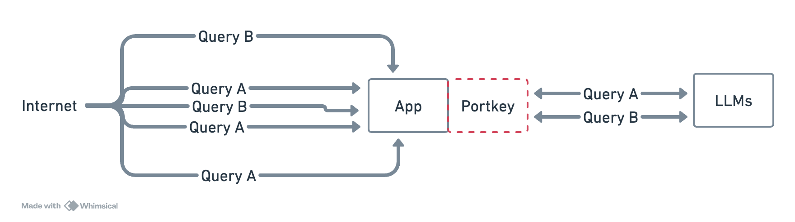
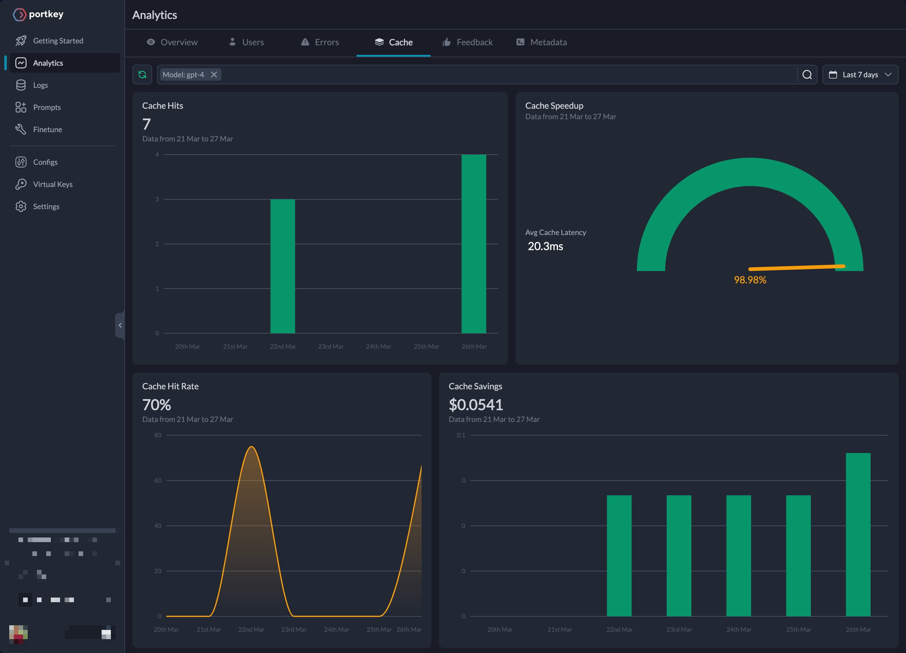
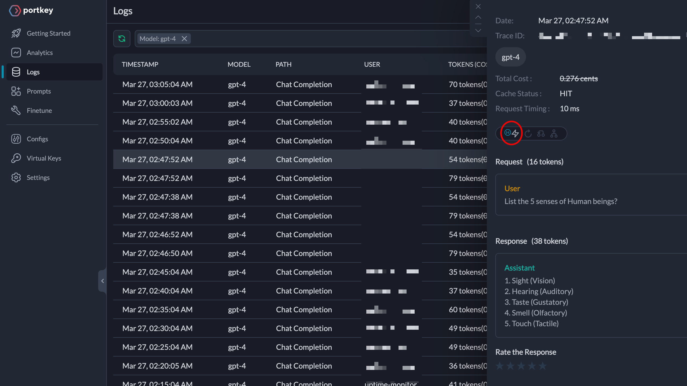

# Prevent unnecessary LLM requests with the Portkey Cache

If you have multiple users of your GenAI app triggering the same or similar queries to your models, fetching LLM response from the models can be slow and expensive. This is because it requires multiple round trips from your app to the model and you may end up paying for the duplicate queries.

To avoid such unnecessary LLM requests, you can use Portkey as your first line of defense. It is highly effective and can be made to work across the 100+ LLMs it supports by simply making changes to a few lines of code.

## How Portkey Cache Works

All requests that have caching enabled on them will serve the subsequent responses from the Portkey’s cache.



Portkey offers two main ways of Caching techniques to enable on your requests — Simple and Semantic.

In short:

- Simple caching refers for identical input prompts to serve from cache.
- Semantic caching refers to an similarity threshold (uses cosine similarity) to serve from cache.

For detailed information, check out [this](https://portkey.ai/blog/reducing-llm-costs-and-latency-semantic-cache/) blog post.

## 1. Import and Authenticate Portkey Client SDK

You now have a brief mindmap of Portkey's approach to caching responses from LLMs.

Let's utilize the Portkey Client SDK to send chat completion requests and attach gateway configs, which in turn activate caching.

To install it, type the following in your NodeJS environment:

```sh
npm install portkey-ai
```

Instantiate Portkey instance

```js
const portkey = new Portkey({
  apiKey: 'xxxxrk',
  virtualKey: 'maixxx4d'
});
```

At this point, it’s essential to understand that you instantiate the `portkey` instance with `apiKey` and `virtualKey` parameters. You can find the arguments for both of them in your Portkey Dashboard.

Visit the reference to [obtain the Portkey API key](https://portkey.ai/docs/api-reference/authentication) and learn [how to create Virtual Keys](https://portkey.ai/docs/product/ai-gateway-streamline-llm-integrations/virtual-keys#creating-virtual-keys).

## 2. Use Gateway Configs to enable Caching

The AI gateway caches your requests and serves it respecting the gateway configs on the request headers. The configs are a simple JS object or JSON string that contains following key-value pairs.

The `mode` key specifies the desired strategy of caching you want for your app.

```js
// Simple Caching
"cache": { "mode": "simple" }

// Semantic Caching
"cache": { "mode": "semantic" }

```

Next up, attach these configs to the request using Portkey SDK. The SDK accepts an `config` parameter that can accept these configurations as an argument. To learn about more ways, refer to the [101 on Gateway Configs](https://github.com/Portkey-AI/portkey-cookbook/blob/main/ai-gateway/101-portkey-gateway-configs.md#a-reference-gateway-configs-from-the-ui).

## 3. Make API calls, Serve from Cache

We are now ready to put what we’ve learned so far into action. We plan on making two requests to an OpenAI model (as an example) while one of them has simple caching activated on it, while other has semantic caching enabled.

```js
// Simple Cache
let simpleCacheResponse = await portkey.chat.completions.create(
  {
    model: 'gpt-4',
    messages: [
      {
        role: 'user',
        content: 'What are 7 wonders of the world?'
      }
    ]
  },
  {
    config: JSON.stringify({
      cache: {
        mode: 'simple'
      }
    })
  }
);

console.log('Simple Cached Response:\n', simpleCacheResponse.choices[0].message.content);
```

Whereas for semantic caching,

```js
let semanticCacheResponse = await portkey.chat.completions.create(
  {
    model: 'gpt-4',
    messages: [
      {
        role: 'user',
        content: 'List the 5 senses of Human beings?'
      }
    ]
  },
  {
    config: JSON.stringify({
      cache: {
        mode: 'semantic'
      }
    })
  }
);

console.log('\nSemantically Cached Response:\n', semanticCacheResponse.choices[0].message.content);
```

On the console:

```sh
Simple Cached Response:
 1. The Great Wall of China
2. Petra, Jordan
3. Christ the Redeemer Statue, Brazil
4. Machu Picchu, Peru
5. The Chichen Itza Pyramid, Mexico
6. The Roman Colosseum, Italy
7. The Taj Mahal, India

Semantically Cached Response:
 1. Sight (Vision)
2. Hearing (Auditory)
3. Taste (Gustatory)
4. Smell (Olfactory)
5. Touch (Tactile)
```

Try experimenting with rephrasing the prompts in the `messages` array and see if you notice any difference in the time it takes to receive a response or the quality of the response itself.

Can you refresh the cache on demand? Yes, you can!

Can you control how long the cache remains active? Absolutely!

Explore the [docs](https://portkey.ai/docs/product/ai-gateway-streamline-llm-integrations/cache-simple-and-semantic) on caching to know all the features available to control how you cache the LLM responses.

## 4. View Analytics and Logs

On the **Analytics** page, you can find Portkey's cache performance analytics under the Cache tab.



The **Logs** page displays a list of LLM calls that served responses from cache. The corresponding icon is activated when the cache is hit.



## Next steps

By leveraging simple and semantic caching, you can avoid unnecessary LLM requests, reduce latency, and provide a better user experience. So go ahead and experiment with the Portkey Cache in your own projects – the benefits are just a few lines of code away!

Some suggestions to experiment:

- Try using the configs from the [Portkey UI](https://github.com/Portkey-AI/portkey-cookbook/blob/main/ai-gateway/101-portkey-gateway-configs.md#a-reference-gateway-configs-from-the-ui) as a reference.

- Implement caching when there are [multiple targets](https://github.com/Portkey-AI/portkey-cookbook/blob/main/ai-gateway/how-to-setup-fallback-from-openai-to-azure-openai.md#2-creating-fallback-configs) in your gateway configs. (Here’s a [clue](https://portkey.ai/docs/product/ai-gateway-streamline-llm-integrations/cache-simple-and-semantic#how-cache-works-with-configs))

<details>
<summary>See the full code</summary>

```js
import { Portkey } from 'portkey-ai';

const portkey = new Portkey({
  apiKey: 'xxxxxk',
  virtualKey: 'mxxxxxxxxd'
});

let simpleCacheResponse = await portkey.chat.completions.create(
  {
    model: 'gpt-4',
    messages: [
      {
        role: 'user',
        content: 'What are 7 wonders of the world?'
      }
    ]
  },
  {
    config: JSON.stringify({
      cache: {
        mode: 'simple'
      }
    })
  }
);

console.log('Simple Cached Response:\n', simpleCacheResponse.choices[0].message.content);

let semanticCacheResponse = await portkey.chat.completions.create(
  {
    model: 'gpt-4',
    messages: [
      {
        role: 'user',
        content: 'List the 5 senses of Human beings?'
      }
    ]
  },
  {
    config: JSON.stringify({
      cache: {
        mode: 'semantic'
      }
    })
  }
);

console.log('\nSemantically Cached Response:\n', semanticCacheResponse.choices[0].message.content);
```

</details>
