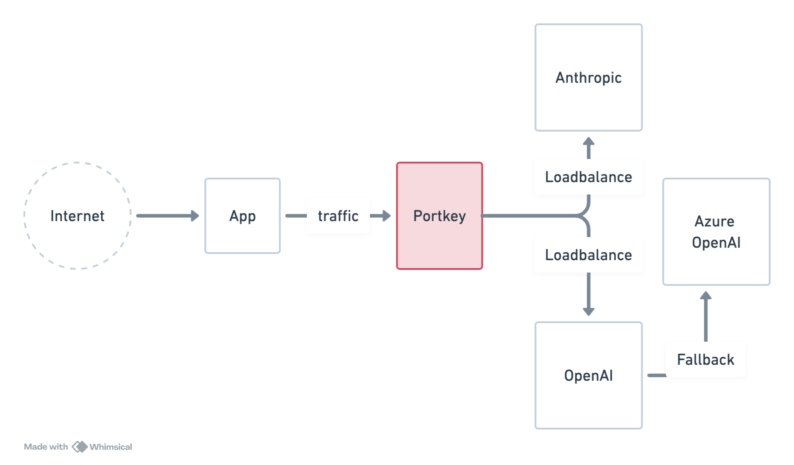
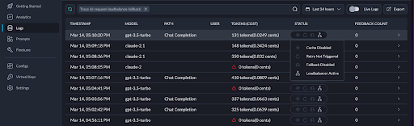

# Setting up resilient Load balancers with failure-mitigating Fallbacks

Companies often face challenges of scaling their services efficiently as the traffic to their applications grow - when you’re consuming APIs, the first point of failure is that if you hit the API too much, you can get rate limited. Loadbalancing is a proven way to scale usage horizontally without overburdening any one provider and thus staying within rate limits.

For your AI app, rate limits are even more stringent, and if you start hitting the providers’ rate limits, there’s nothing you can do except wait to cool down and try again. With Portkey, we help you solve this very easily.

This cookbook will teach you how to utilize Portkey to distribute traffic across multiple LLMs, ensuring that your loadbalancer is robust by setting up backups for requests. Additionally, you will learn how to load balance across OpenAI and Anthropic, leveraging the powerful Claude-3 models recently developed by Anthropic, with Azure serving as the fallback layer.

<span style="text-decoration:underline;">Prerequisites:</span>

You should have the [Portkey API Key](https://portkey.ai/docs/api-reference/authentication#obtaining-your-api-key). Please sign up to obtain it. Additionally, you should have stored the OpenAI, Azure OpenAI, and Anthropic details in the [Portkey vault](https://portkey.ai/docs/product/ai-gateway-streamline-llm-integrations/virtual-keys).

## 1. Import the SDK and authenticate Portkey

Start by installing the `portkey-ai` to your NodeJS project.

```sh
npm i --save portkey-ai
```

Once installed, you can import it and instantiate it with the API key to your Portkey account.

```js
import { Portkey } from 'portkey-ai';

const portkey = new Portkey({
  apiKey: process.env['PORTKEYAI_API_KEY']
});
```

## 2. Create Configs: Loadbalance with Nested Fallbacks

Portkey acts as AI gateway to all of your requests to LLMs. It follows the OpenAI SDK signature in all of it’s methods and interfaces making it easy to use and switch. Here is an example of an chat completions requests through Portkey.

```js
const response = await portkey.chat.completions.create({
  messages,
  model: 'gpt-3.5-turbo'
});
```

The Portkey AI gateway can apply our desired behaviour to the requests to various LLMs. In a nutshell, our desired behaviour is the following:



Lucky for us, all of this can implemented by passing a configs allowing us to express what behavior to apply to every request through the Portkey AI gateway.

```js
const config = {
  strategy: {
    mode: 'loadbalance'
  },
  targets: [
    {
      virtual_key: process.env['ANTHROPIC_VIRTUAL_KEY'],
      weight: 0.5,
      override_params: {
        max_tokens: 200,
        model: 'claude-3-opus-20240229'
      }
    },
    {
      strategy: {
        mode: 'fallback'
      },
      targets: [
        {
          virtual_key: process.env['OPENAI_VIRTUAL_KEY']
        },
        {
          virtual_key: process.env['AZURE_OPENAI_VIRTUAL_KEY']
        }
      ],
      weight: 0.5
    }
  ]
};

const portkey = new Portkey({
  apiKey: process.env['PORTKEYAI_API_KEY'],
  config // pass configs as argument
});
```

We apply the `loadbalance` strategy across _Anthropic and OpenAI._ `weight` describes the traffic should be split into 50/50 among both the LLM providers while `override_params` will help us override the defaults.

Let’s take this a step further to apply a fallback mechanism for the requests from* OpenAI* to fallback to _Azure OpenAI_. This nested mechanism among the `targets` will ensure our app is reliable in the production in great confidence.

See the documentation for Portkey [Fallbacks](https://portkey.ai/docs/product/ai-gateway-streamline-llm-integrations/fallbacks) and [Loadbalancing](https://portkey.ai/docs/product/ai-gateway-streamline-llm-integrations/load-balancing).

## 3. Make a Request

Now that the `config` ‘s are concrete and are passed as arguments when instantiating the Portkey client instance, all subsequent will acquire desired behavior auto-magically — No additional changes to the codebase.

```js
const messages = [
  {
    role: 'system',
    content: 'You are a very helpful assistant.'
  },
  {
    role: 'user',
    content: 'What are 7 wonders in the world?'
  }
];

const response = await portkey.chat.completions.create({
  messages,
  model: 'gpt-3.5-turbo'
});

console.log(response.choices[0].message.content);
// The Seven Wonders of the Ancient World are:
```

Next, we will examine how to identify load-balanced requests or those that have been executed as fallbacks.

## 4. Trace the request from the logs

It can be challenging to identify particular requests from the thousands that are received every day, similar to trying to find a needle in a haystack. However, Portkey offers a solution by enabling us to attach a desired trace ID. Here `request-loadbalance-fallback`.

```js
const response = await portkey.chat.completions.create(
  {
    messages,
    model: 'gpt-3.5-turbo'
  },
  {
    traceID: 'request-loadbalance-fallback'
  }
);
```

This trace ID can be used to filter requests from the Portkey Dashboard (>Logs) easily.



In addition to activating Loadbalance (icon), the logs provide essential observability information, including tokens, cost, and model.

Are the configs growing and becoming harder to manage in the code? [Try creating them from Portkey UI](https://portkey.ai/docs/product/ai-gateway-streamline-llm-integrations/configs#creating-configs) and reference the configs ID in your code. It will make it significantly easier to maintain.

## 5. Advanced: Canary Testing

Given there are new models coming every day and your app is in production — What is the best way to try the quality of those models? Canary Testing allows you to gradually roll out a change to a small subset of users before making it available to everyone.

Consider this scenario: You have been using OpenAI as your LLM provider for a while now, but are considering trying an open-source Llama model for your app through Anyscale.

```js
const config = {
  strategy: {
    mode: 'loadbalance'
  },
  targets: [
    {
      virtual_key: process.env['OPENAI_VIRTUAL_KEY'],
      weight: 0.9
    },
    {
      virtual_key: process.env['ANYSCALE_VIRTUAL_KEY'],
      weight: 0.1,
      override_params: {
        model: 'meta-llama/Llama-2-70b-chat-hf'
      }
    }
  ]
};

const portkey = new Portkey({
  apiKey: process.env['PORTKEYAI_API_KEY'],
  config
});

const response = await portkey.chat.completions.create(
  {
    messages,
    model: 'gpt-3.5-turbo'
  },
  {
    traceID: 'canary-testing'
  }
);

console.log(response.choices[0].message.content);
```

The `weight` , indication of traffic is split to have 10% of your user-base are served from Anyscale’s Llama models. Now, you are all set up to get feedback and observe the performance of your app and release increasingly to larger userbase.

## Considerations

You can implement production-grade Loadbalancing and nested fallback mechanisms with just a few lines of code. While you are equipped with all the tools for your next GenAI app, here are a few considerations:

- Every request has to adhere to the LLM provider’s requirements for it to be successful. For instance, `max_tokens` is required for Anthropic and not for OpenAI.
- While loadbalance helps reduce the load on one LLM - it is recommended to pair it with a Fallback strategy to ensure that your app stays reliable
- On Portkey, you can also pass the loadbalance weight as 0 - this will essentially stop routing requests to that target and you can amp it up when required
- Loadbalance has no target limits as such, so you can potentially add multiple account details from one provider and effectively multiply your available rate limits
- Loadbalance does not alter the outputs or the latency of the requests in any way

Happy Coding!

<details>
<summary>See the entire code</summary>

```js
import { Portkey } from 'portkey-ai';

const config = {
  strategy: {
    mode: 'loadbalance'
  },
  targets: [
    {
      virtual_key: process.env['ANTHROPIC_VIRTUAL_KEY'],
      weight: 0.5,
      override_params: {
        max_tokens: 200,
        model: 'claude-2.1'
      }
    },
    {
      strategy: {
        mode: 'fallback'
      },
      targets: [
        {
          virtual_key: process.env['OPENAI_VIRTUAL_KEY']
        },
        {
          virtual_key: process.env['AZURE_OPENAI_VIRTUAL_KEY']
        }
      ],
      weight: 0.5
    }
  ]
};

const portkey = new Portkey({
  apiKey: process.env['PORTKEYAI_API_KEY'],
  config
});

const messages = [
  {
    role: 'system',
    content: 'You are a very helpful assistant.'
  },
  {
    role: 'user',
    content: 'What are 7 wonders in the world?'
  }
];

const response = await portkey.chat.completions.create(
  {
    messages,
    model: 'gpt-3.5-turbo'
  },
  {
    traceID: 'request-loadbalance-fallback'
  }
);

console.log(response.choices[0].message.content);
```

</details>
