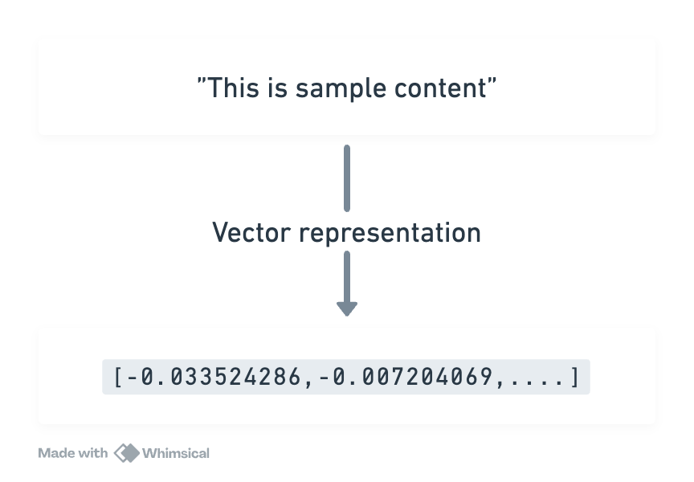
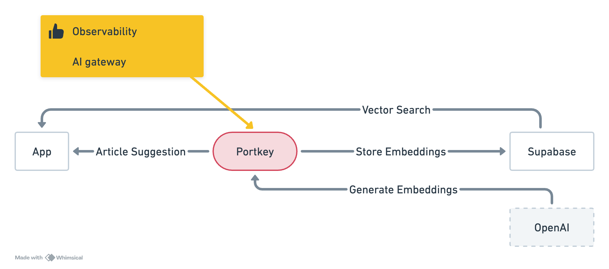
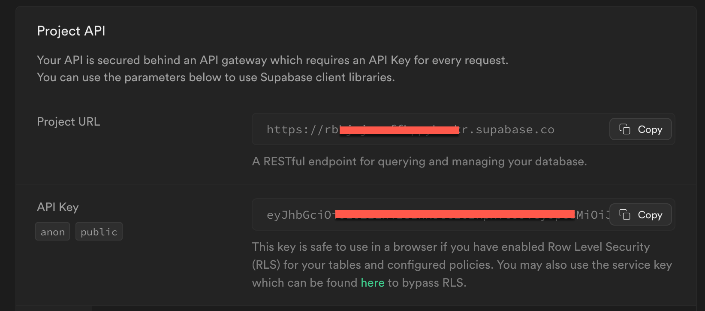
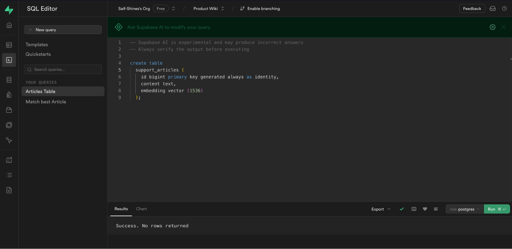
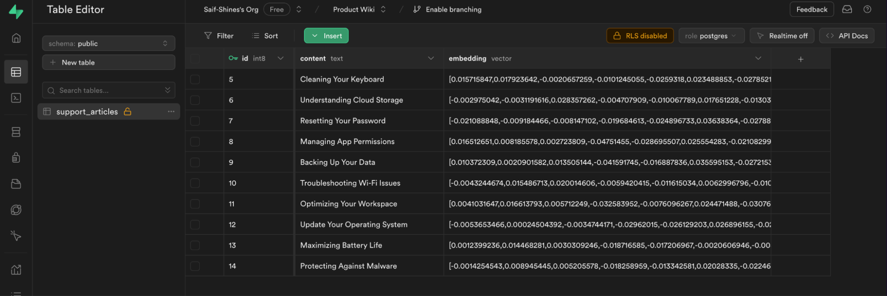
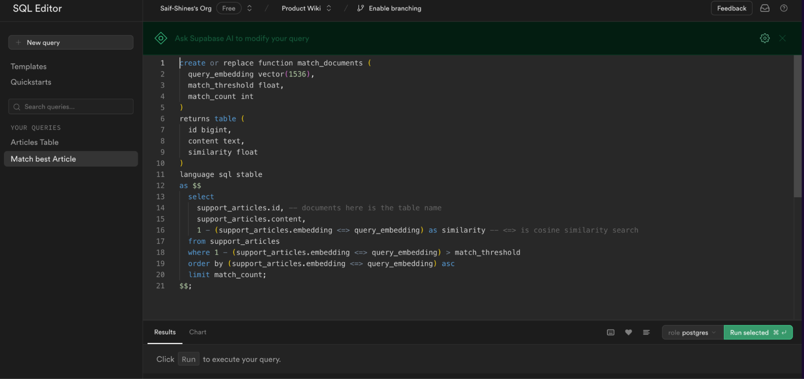
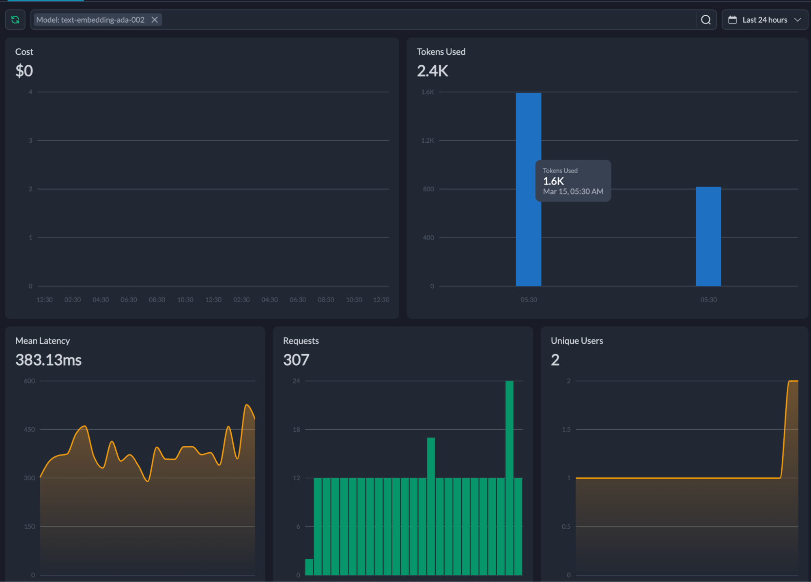

# Build an article suggestion app with Supabase pgvector, and Portkey

Consider that you have list of support articles that you want to suggest it to users when users search for it. You want to suggest as best fit as possible. With the availability of tools like Large Language Model (LLMs) and Vector Databases, the approach towards suggestions & recommendation systems has significantly evolved.

In this article, we will go over and create a simple NodeJS application that stores the _support articles_ (only titles, for simplicity) and perform vector similarity search thorough it’s embeddings and return the best article to the user.

A quick disclaimer:

This article is meant to give you a map that can help you get started and navigate the solutions against similar problem statements.

Please explore codebase on [this Repl](https://replit.com/@portkey/Store-Embeddings-To-Supabase-From-Portkey), if you are interested to start with code tinkering.

### What makes vector similarity special?

Short answer: Embeddings.

The technique to translate a piece of content into vector representation is called embeddings. They allow you to analyze the semantic content mathematically.



The LLMs are capable of turning our content into vector representation, and embed them into the vector space, where similarity is concluded based on the distance between two embeddings. These embeddings are to be stored on vector databases.

In this article, we will use Supabase and enable pgvector to store vectors.

### Overview of our app

Our app will utilize the Supabase vector database to maintain articles in the form of embeddings. Upon receiving a new query, the database will intelligently recommend the most relevant article.



This is how the process will work:

1. The application will read a text file containing a list of article titles.
2. It will then use OpenAI models through Portkey to convert the content into embeddings.
3. These embeddings will be stored in pgvector, along with a function that enables similarity matching.
4. When a user enters a new query, the application will return the most relevant article based on the similarity match database function.

### Setup

Get going by setting up 3 things for this tutorial — NodeJS project, Portkey and Supabase.

<span style="text-decoration:underline;">Portkey</span>

1. [Sign up](https://portkey.ai/) and login into Portkey dashboard.
2. Copy your OpenAI API key and add it to [Portkey Vault](https://portkey.ai/docs/product/ai-gateway-streamline-llm-integrations/virtual-keys).

This will give you a unique identifier, virtual key, that you can reference in the code. More on this later on.

<span style="text-decoration:underline;">Supabase</span>

Head to Supabase to create a _New Project._ Give it a name of your choice. I will label it “_Product Wiki_”. This step will provide access keys, such as the _Project URL_ and _API Key_. Save them.



The project is ready.

We want to store embeddings in your database. To enable the database to store embeddings, you must enable _Vector_ extension from _[Dashboard > Database > Extensions](https://supabase.com/docs/guides/database/extensions)_.

<span style="text-decoration:underline;">NodeJS</span>

Navigate into any of your desired directories and run

```sh
npm init -y
```

See the project files creates with `package.json`. Since we want to store the list of articles to database, we have to read them for a file. Create `articles.txt` and copy the following:

```md
Update Your Operating System
Resetting Your Password
Maximizing Battery Life
Cleaning Your Keyboard
Protecting Against Malware
Backing Up Your Data
Troubleshooting Wi-Fi Issues
Optimizing Your Workspace
Understanding Cloud Storage
Managing App Permissions
```

Open the `index.js` and you are ready. Let’s start writing code.

### Step 1: Importing and authenticating Portkey and Supabase

Since our app is set to interact with OpenAI (via Portkey) and Supabase pgvector database, let’s import the necessary SDK clients to run operations on them.

```js
import { Portkey } from 'portkey-ai';
import { createClient } from '@supabase/supabase-js';
import fs from 'fs';

const USER_QUERY = 'How to update my laptop?';

const supabase = createClient('https://rbhjxxxxxxxxxkr.supabase.co', process.env['SUPABASE_PROJECT_API_KEY']);

const portkey = new Portkey({
  apiKey: process.env['PORTKEY_API_KEY'],
  virtualKey: process.env['OPENAI_VIRTUAL_KEY']
});
```

`fs` to help us read the list of articles from a `articles.txt` file and `USER_QUERY` is the query we will use to do similarity search.

### Step 2: Create a Table

We can use the SQL Editor to execute SQL queries. We will have one table for this project, and let’s call it `support_articles` table. It will store the _title_ of the article along with it’s embeddings. Please feel free to add more fields of your choice, such as description or tags.

For simplicity, create a table with columns for `ID`, `content`, and `embedding`.

```sql
create table
  support_articles (
    id bigint primary key generated always as identity,
    content text,
    embedding vector (1536)
  );
```

Execute the above SQL query in the SQL editor.



You can verify that the table has been created by navigating to Database > Tables > support_articles. A success message will appear in the Results tab once the execution is successful.

## Step 3: Read, Generate and Store embeddings

We will use the `fs` library to read the `articles.txt` and convert every title on the list into embeddings. With Portkey, generating embeddings is straightforward and same as working with OpenAI SDK and no additional code changes required.

```js
const response = await portkey.embeddings.create({
  input: String(text),
  model: 'text-embedding-ada-002'
});
return Array.from(response.data[0].embedding);
```

Similarly to store embeddings to Supabase:

```js
await supabase.from('support_articles').insert({
  content,
  embedding
});
```

To put everything together — reading from the file, generating embeddings, and storing them supabase.

```js
async function convertToEmbeddings(text) {
  const response = await portkey.embeddings.create({
    input: String(text),
    model: 'text-embedding-ada-002'
  });
  return Array.from(response.data[0].embedding);
}

async function readTitlesFromFile() {
  const titlesPath = './articles.txt';
  const titles = fs
    .readFileSync(titlesPath, 'utf8')
    .split('\n')
    .map((title) => title.trim());
  return titles;
}

async function storeSupportArticles() {
  const titles = await readTitlesFromFile();

  titles.forEach(async function (title) {
    const content = title;
    const embedding = await convertToEmbeddings(content);

    await supabase.from('support_articles').insert({
      content,
      embedding
    });
  });
}
```

That’s it! — All you need to write one line to store all the items to the pgvector database.

`await storeSupportArticles();`

You should now see the rows created from the Table Editor.



### Step 4: Create a database function to query similar match

Next, let’s set up a [database function](https://supabase.com/docs/guides/database/functions) to do vector similarity search using Supabase. This database function will take _an user query vector_ as argument and return us an object with the `id`, `content` and the `similarity` score against the best row and user query in the database.

```sql
create or replace function match_documents (
  query_embedding vector(1536),
  match_threshold float,
  match_count int
)
returns table (
  id bigint,
  content text,
  similarity float
)
language sql stable
as $$
  select
    support_articles.id, -- documents here is the table name
    support_articles.content,
    1 - (support_articles.embedding <=> query_embedding) as similarity -- <=> is cosine similarity search
  from support_articles
  where 1 - (support_articles.embedding <=> query_embedding) > match_threshold
  order by (support_articles.embedding <=> query_embedding) asc
  limit match_count;
$$;
```

Execute it in the SQL Editor similar to the table creation.



Congratulations, now our `support_articles` is now powered to return vector similarity search operations.

No more waiting! Let’s run an search query.

### Step 5: Query for the similarity match

The supabase client can make an remote procedure calls to invoke our vector similarity search function to find the nearest match to the user query.

```js
async function findNearestMatch(queryEmbedding) {
  const { data } = await supabase.rpc('match_documents', {
    query_embedding: queryEmbedding,
    match_threshold: 0.5,
    match_count: 1
  });
  return data;
}
```

The arguments will match the parameters we declared while creating the database function (in Step 4).

```js
const USER_QUERY = 'How to update my laptop?';

// Invoke the following Fn to store embeddings to Supabase
// await storeSupportArticles();

const queryEmbedding = await convertToEmbeddings(USER_QUERY);
let best_match = await findNearestMatch(queryEmbedding);
console.info('The best match is: ', best_match);
```

The console log

```sh
The best match is:  [
  {
    id: 12,
    content: 'Update Your Operating System',
    similarity: 0.874387819265234
  }
]
```

### Afterthoughts

A single query with the best match for the user query mentioned above took 6 tokens and costed approximately $0.0001 cents. During the development of this app, I used up 2.4k tokens with a mean latency of 383ms.

You might be wondering how I know all of this? Well, it's all thanks to the Portkey Dashboard.



This information is incredibly valuable, especially when used in real-time production. I encourage you to consider implementing search use cases in your ongoing projects such as recommendations, suggestions, and similar items.

Congratulations on making it this far! You now know how to work with embeddings in development and monitor your app in production.
