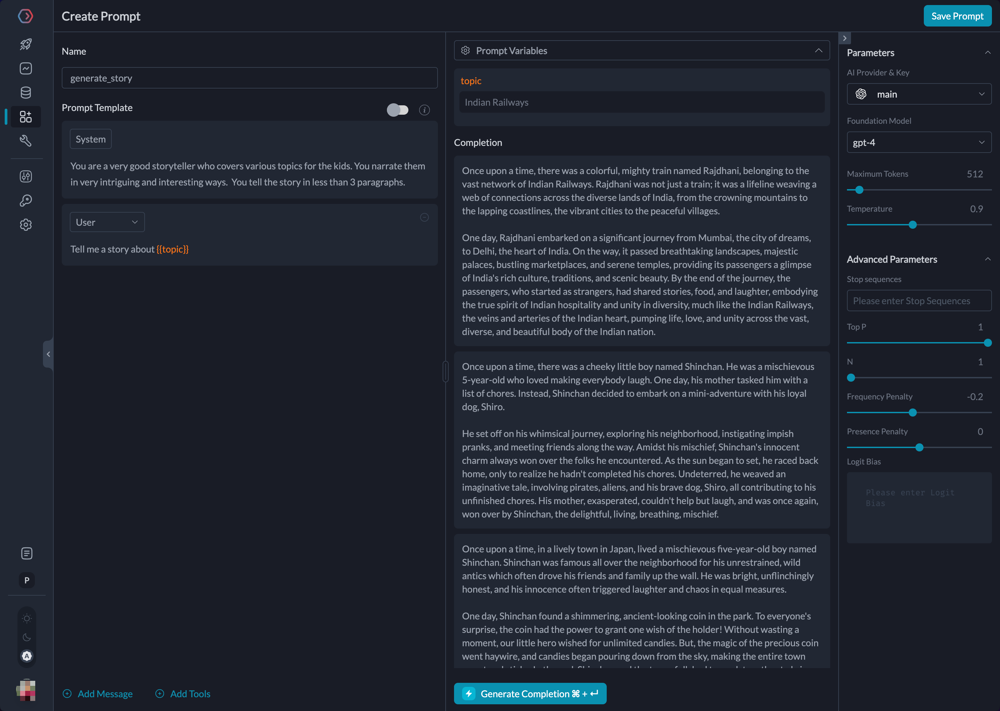

# How to use OpenAI SDK with Portkey Prompt Templates

Portkey's Prompt Playground allows you to test and tinker with various hyperparameters without any external dependencies and deploy them to production seamlessly. Moreover, all team members can use the same prompt template, ensuring that everyone works from the same source of truth.

Right within OpenAI SDK along with Portkey APIs, you can use prompt templates to achieve this. Just keep following this approach throughout the cookbook.

## 1. Creating a Prompt Template

Portkey's quick playground enables you to experiment with various LLM providers. It acts as a definitive source of truth for your team, and it versions each snapshot of model parameters, allowing for easy rollback. We want to create a chat completion prompt with `gpt4` that tells a story about any user-desired topic.

To do this:

1. Go to **www.portkey.ai**
2. Opens a Dashboard
   1. Click on **Prompts** and then the **Create** button.
3. You are now on Prompt Playground.

Spend some time playing around with different prompt inputs and changing the hyperparameters. The following settings seemed most suitable and generated a story that met expectations.



The list of parameters in my prompt template:

| System            | `You are a very good storyteller who covers various topics for the kids. You narrate them in very intriguing and interesting ways. You tell the story in less than 3 paragraphs.` |
| ----------------- | --------------------------------------------------------------------------------------------------------------------------------------------------------------------------------- |
| User              | `Tell me a story about {{topic}}`                                                                                                                                                 |
| Max Tokens        | `512`                                                                                                                                                                             |
| Temperature       | `0.9`                                                                                                                                                                             |
| Frequency Penalty | `-0.2`                                                                                                                                                                            |

When you look closely at the description for the User role, you find `{{topic}}`. Portkey treats them as dynamic variables, so a string can be passed to this prompt at runtime. This prompt is much more useful since it generates stories on any topic.

Once you are happy with the Prompt Template, hit **Save Prompt**. The Prompts page displays saved prompt templates and their corresponding prompt ID, serving as a reference point in our code.

Next up, let’s see how to use the created prompt template to generate chat completions through OpenAI SDK.

## 2. Retrieving the prompt template

Fire up your code editor and import the request client, `axios`. This will allow you to POST to the Portkey's render endpoint and retrieve prompt details that can be used with OpenAI SDK.

We will use `axios` to make a `POST` call to `/prompts/${PROMPT_ID}/render` endpoint along with headers (includes [Portkey API Key](https://portkey.ai/docs/api-reference/authentication#obtaining-your-api-key)) and body that includes the prompt variables required in the prompt template.

For more information about Render API, refer to the [docs](https://portkey.ai/docs/api-reference/prompts/render).

```js
import axios from 'axios';

const PROMPT_ID = '<prompt-id>';
const PORTKEYAI_API_KEY = '<api_key>';

const url = `https://api.portkey.ai/v1/prompts/${PROMPT_ID}/render`;

const headers = {
  'Content-Type': 'application/json',
  'x-portkey-api-key': PORTKEYAI_API_KEY
};

const data = {
  variables: { topic: 'Tom and Jerry' }
};

let {
  data: { data: promptDetail }
} = await axios.post(url, data, { headers });

console.log(promptDetail);
```

We get prompt details as a JS object logged to the console:

```js
{
  model: 'gpt-4',
  n: 1,
  top_p: 1,
  max_tokens: 512,
  temperature: 0.9,
  presence_penalty: 0,
  frequency_penalty: -0.2,
  messages: [
    {
      role: 'system',
      content: 'You are a very good storyteller who covers various topics for the kids. You narrate them in very intriguing and interesting ways.  You tell the story in less than 3 paragraphs.'
    },
    { role: 'user', content: 'Tell me a story about Tom and Jerry' }
  ]
}
```

## 3. Sending requests through OpenAI SDK

This section will teach you to use the prompt details JS object we retrieved earlier and pass it as an argument to the instance of the OpenAI SDK when making the chat completions call.

Let’s import the necessary libraries and create a client instance from the OpenAI SDK.

```js
import OpenAI from 'openai';
import { createHeaders, PORTKEY_GATEWAY_URL } from 'portkey-ai';

const client = new OpenAI({
  apiKey: 'USES_VIRTUAL_KEY',
  baseURL: PORTKEY_GATEWAY_URL,
  defaultHeaders: createHeaders({
    provider: 'openai',
    apiKey: `${PORTKEYAI_API_KEY}`,
    virtualKey: `${OPENAI_VIRTUAL_KEY}`
  })
});
```

We are importing `portkey-ai` to use its utilities to change the base URL and the default headers. If you are wondering what virtual keys are, refer to [Portkey Vault documentation](https://portkey.ai/docs/product/ai-gateway-streamline-llm-integrations/virtual-keys).

The prompt details we retrieved are passed as an argument to the chat completions creation method.

```js
let TomAndJerryStory = await generateStory('Tom and Jerry');
console.log(TomAndJerryStory);

async function generateStory(topic) {
  const data = {
    variables: { topic: String(topic) }
  };

  let {
    data: { data: promptDetail }
  } = await axios.post(url, data, { headers });

  const chatCompletion = await client.chat.completions.create(promptDetail);

  return chatCompletion.choices[0].message.content;
}
```

This time, run your code and see the story we set out to generate logged to the console!

```md
In the heart of a bustling city, lived an eccentric cat named Tom and a witty little mouse named Jerry. Tom, always trying to catch Jerry, maneuvered himself th...(truncated)
```

## Bonus: Using Portkey SDK

The official Portkey Client SDK has a prompts completions method that is similar to chat completions’ OpenAI signature. You can invoke a prompt template just by passing arguments to `promptID` and `variables` parameters.

```js
const promptCompletion = await portkey.prompts.completions.create({
  promptID: 'Your Prompt ID',
  variables: {
    topic: 'Tom and Jerry'
  }
});
```

## Conclusion

We’ve now finished writing a some NodeJS program that retrieves the prompt details from the Prompt Playground using prompt ID. Then successfully made a chat completion call using OpenAI SDK to generate a story with the desired topic.

We can use this approach to focus on improving prompt quality with all the LLMs supported, simply reference them at the code runtime.

<details>
  <summary>
  Show me the entire code
  </summary>

```js
import axios from 'axios';
import OpenAI from 'openai';
import { createHeaders, PORTKEY_GATEWAY_URL } from 'portkey-ai';

const PROMPT_ID = 'xxxxxx';
const PORTKEYAI_API_KEY = 'xxxxx';
const OPENAI_VIRTUAL_KEY = 'xxxx';

const url = `https://api.portkey.ai/v1/prompts/${PROMPT_ID}/render`;

const headers = {
  'Content-Type': 'application/json',
  'x-portkey-api-key': PORTKEYAI_API_KEY
};

const client = new OpenAI({
  apiKey: 'USES_VIRTUAL_KEY',
  baseURL: PORTKEY_GATEWAY_URL,
  defaultHeaders: createHeaders({
    provider: 'openai',
    apiKey: `${PORTKEYAI_API_KEY}`,
    virtualKey: `${OPENAI_VIRTUAL_KEY}`
  })
});

let TomAndJerryStory = await generateStory('Tom and Jerry');
console.log(TomAndJerryStory);

async function generateStory(topic) {
  const data = {
    variables: { topic: String(topic) }
  };

  let {
    data: { data: promptDetail }
  } = await axios.post(url, data, { headers });

  const chatCompletion = await client.chat.completions.create(promptDetail);

  return chatCompletion.choices[0].message.content;
}
```

</detials>
