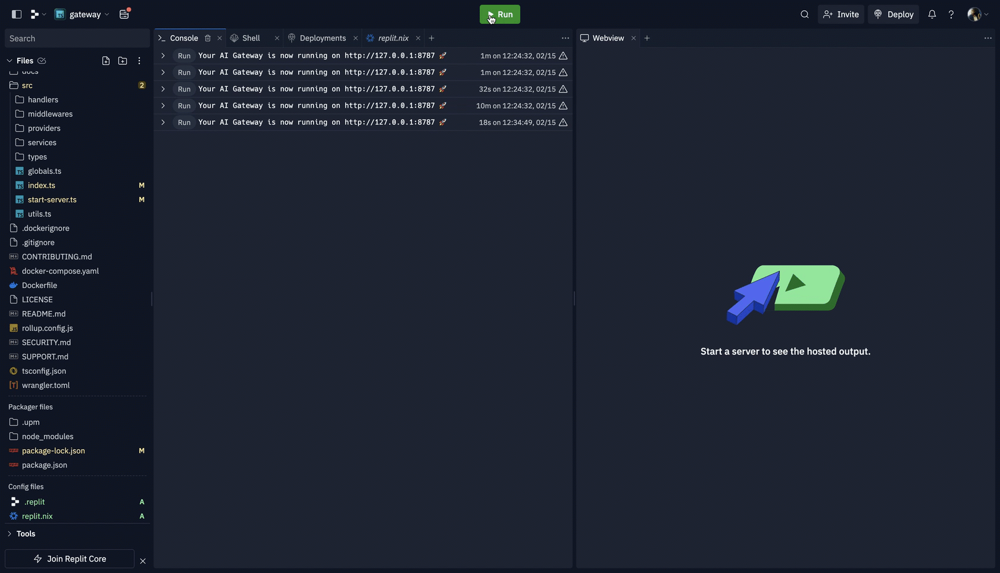

# Install, Run & Deploy AI Gateway

## Locally
Ensure [NodeJS is installed](https://nodejs.org/en/learn/getting-started/how-to-install-nodejs).

To quick-run the AI gateway locally:

**Node**
```sh
$ npx @portkey-ai/gateway
Your AI Gateway is now running on http://localhost:8787 🚀
```

**Bun**

```sh
$ bunx @portkey-ai/gateway
Your AI Gateway is now running on http://localhost:8787 🚀
```

## Replit



Clone or directly [import](https://docs.replit.com/programming-ide/using-git-on-replit/import-repository) the AI gateway repository to [Replit](https://replit.com/).

<details>
<summary> Unhide hidden files to edit `.replit` & `replit.nix` </summary>
<i>.replit</i>
<code>
run = "npm run dev:node"
hidden = [".config", "package-lock.json", "tsconfig.json"]
</code>

<i>.replit</i>
<code>
{ pkgs }: {
    deps = [
        pkgs.yarn
        pkgs.esbuild
        pkgs.nodejs-19_x // Ensure 18.2+ Node Version
        pkgs.nodePackages.typescript
        pkgs.nodePackages.typescript-language-server
    ];
}
</code>
</details>
