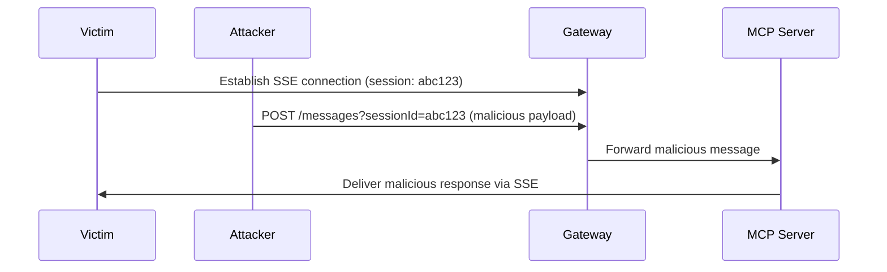
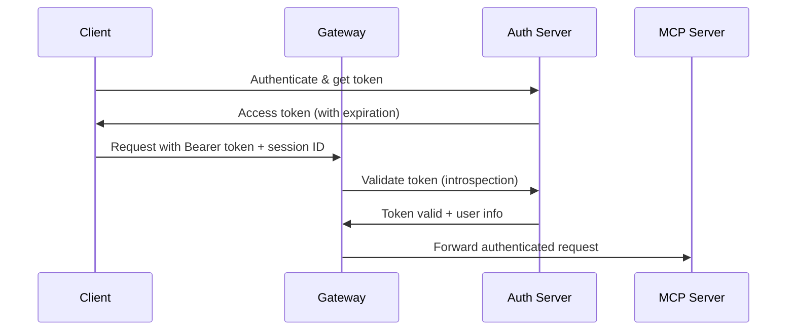

# Session Hijacking Mitigation in MCP Gateway

## Executive Summary

This document outlines session hijacking vulnerabilities identified in the Model Context Protocol (MCP) Gateway and the security controls implemented to mitigate these risks. The gateway employs a defense-in-depth strategy centered on OAuth 2.1 authentication with enhanced session lifecycle management.

**Risk Level**: Medium → Low (Post-mitigation)  
**Primary Mitigation**: OAuth 2.1 enforcement with token-aligned session expiration  
**Secondary Controls**: Session lifecycle management, security monitoring, audit logging

---

## Threat Analysis

### 1. Session Hijacking Attack Vectors

#### 1.1 Session ID Theft and Reuse
**Threat**: Attackers obtain valid session IDs through various means and attempt to impersonate legitimate users.

**Attack Scenarios**:
- Network interception of session IDs in headers (`mcp-session-id`)
- Log file exposure containing session identifiers
- Browser developer tools or debugging information leakage
- Man-in-the-middle attacks on unencrypted connections

**Impact**: Unauthorized access to MCP servers, tool execution, and data exfiltration

#### 1.2 Session Fixation
**Threat**: Attackers force users to use predetermined session IDs, then hijack the session after authentication.

**Attack Flow**:
```
1. Attacker generates session ID
2. Tricks user into using attacker's session ID
3. User authenticates with attacker's session
4. Attacker uses known session ID to access user's resources
```

#### 1.3 Cross-User Session Access
**Threat**: Users accessing sessions belonging to other users due to insufficient session validation.

**Risk Factors**:
- Predictable session ID generation
- Lack of user-session binding validation
- Session persistence beyond authentication lifecycle

### 2. MCP-Specific Attack Vectors

#### 2.1 SSE Message Injection
**Threat**: Attackers inject malicious messages into Server-Sent Event streams using hijacked session IDs.

**Attack Flow**:


#### 2.2 Tool Execution Hijacking
**Threat**: Unauthorized tool execution through hijacked MCP sessions.

**Impact**:
- Data exfiltration through tool calls
- Unauthorized system modifications
- Privilege escalation within connected systems

---

## Security Architecture

### 1. Primary Security Boundary: OAuth 2.1

The MCP Gateway implements OAuth 2.1 as the primary security control, ensuring all requests are authenticated and authorized before session access.

#### 1.1 Authentication Flow


#### 1.2 Token Validation
- **Token Introspection**: Every request validates token with authorization server
- **Scope Verification**: Ensures token has required MCP scopes (`mcp:servers:*`)
- **Expiration Checking**: Rejects expired tokens immediately
- **Client Validation**: Verifies token was issued to expected client

### 2. Session Security Controls

#### 2.1 Token-Aligned Session Lifecycle
Sessions are bound to OAuth token lifecycle, preventing session reuse after token expiration.

```typescript
// Session expiration tied to token
session.setTokenExpiration(tokenInfo);

// Automatic session cleanup
if (session.isTokenExpired()) {
  sessionStore.delete(sessionId);
  return 401; // Force re-authentication
}
```

#### 2.2 Secure Session Generation
- **Cryptographically Secure IDs**: Uses `crypto.randomUUID()` for session generation
- **Non-Predictable**: 128-bit entropy prevents session guessing attacks
- **Unique Per Request**: New sessions created for each authentication flow

#### 2.3 Session Validation Pipeline
```typescript
// Middleware execution order (security-first)
app.all('/:serverId/mcp',
  oauthMiddleware({required: true}),    // 1. OAuth validation
  hydrateContext,                      // 2. Load server config
  sessionMiddleware(sessionStore),     // 3. Session management
  handleMCPRequest                     // 4. Business logic
);
```

---

## Mitigation Controls

### 1. Authentication Controls

| Control | Implementation | Risk Mitigation |
|---------|---------------|-----------------|
| **Mandatory OAuth** | `OAUTH_REQUIRED = true` | Prevents unauthenticated session access |
| **Token Introspection** | Real-time token validation | Blocks revoked/expired tokens |
| **Scope Enforcement** | `mcp:servers:*` required | Limits access to authorized resources |
| **Client Validation** | Client ID verification | Prevents token misuse across clients |

### 2. Session Controls

| Control | Implementation | Risk Mitigation |
|---------|---------------|-----------------|
| **Token-Bound Expiration** | `session.setTokenExpiration()` | Sessions expire with tokens |
| **Automatic Cleanup** | Periodic expired session removal | Prevents stale session reuse |
| **Secure ID Generation** | `crypto.randomUUID()` | Prevents session prediction |
| **Transport Security** | HTTPS enforcement | Protects session IDs in transit |

### 3. Monitoring Controls

| Control | Implementation | Risk Mitigation |
|---------|---------------|-----------------|
| **Session Reconnaissance Detection** | Log invalid session access | Identifies attack attempts |
| **Token Expiration Logging** | Track expired session usage | Monitors token lifecycle |
| **Authentication Failures** | OAuth rejection logging | Detects credential attacks |
| **Audit Trail** | Comprehensive request logging | Enables incident investigation |

---

## Security Monitoring

### 1. Key Security Events

#### 1.1 Authentication Events
```json
{
  "event": "oauth_token_rejected",
  "reason": "expired",
  "client_id": "client-123",
  "requested_scopes": ["mcp:servers:linear"],
  "timestamp": "2024-01-15T10:30:00Z"
}
```

#### 1.2 Session Events
```json
{
  "event": "session_expired",
  "session_id": "abc123",
  "expiry_reason": "token_expired",
  "last_activity": "2024-01-15T10:25:00Z",
  "timestamp": "2024-01-15T10:30:00Z"
}
```

#### 1.3 Security Events
```json
{
  "event": "session_reconnaissance",
  "session_id": "invalid-123",
  "user_id": "user-456",
  "client_id": "client-789",
  "request_path": "/server1/mcp",
  "ip_address": "192.168.1.100",
  "timestamp": "2024-01-15T10:30:00Z"
}
```

### 2. Security Metrics

#### 2.1 Key Performance Indicators
- **Authentication Success Rate**: `successful_auths / total_auth_attempts`
- **Session Hijacking Attempts**: Count of invalid session access attempts
- **Token Expiration Rate**: Frequency of expired token usage
- **Session Cleanup Efficiency**: Percentage of expired sessions removed

#### 2.2 Alert Thresholds
- **High**: >10 invalid session attempts per minute from single IP
- **Medium**: >5% authentication failure rate
- **Low**: Unusual session access patterns

---

## Compliance and Standards

### 1. Security Standards Alignment

| Standard | Requirement | Implementation |
|----------|-------------|----------------|
| **OAuth 2.1** | Secure token handling | Full OAuth 2.1 compliance |
| **RFC 9700** | OAuth security best practices | Token introspection, secure scopes |
| **OWASP ASVS** | Session management | Secure session lifecycle |
| **NIST Cybersecurity** | Authentication controls | Multi-factor authentication support |

### 2. MCP Security Best Practices

Following [MCP Security Best Practices](https://spec.modelcontextprotocol.io/specification/draft/security/):

- ✅ **No Token Passthrough**: All tokens validated by gateway
- ✅ **Request Validation**: Every request authenticated
- ✅ **Session Security**: No session-based authentication
- ✅ **Audit Logging**: Comprehensive security event logging

---

## Incident Response

### 1. Session Hijacking Detection

#### 1.1 Indicators of Compromise
- Multiple failed session validations from single user
- Session access from unusual IP addresses or locations
- High volume of expired session usage attempts
- Unusual tool execution patterns

#### 1.2 Response Procedures
1. **Immediate**: Block suspicious IP addresses
2. **Short-term**: Revoke affected user tokens
3. **Medium-term**: Force re-authentication for affected users
4. **Long-term**: Review and enhance monitoring rules

### 2. Forensic Capabilities

#### 2.1 Available Logs
- OAuth token validation events
- Session creation and expiration events
- Request-level audit trails with user context
- Security event logs with IP and user agent data

#### 2.2 Investigation Queries
```bash
# Find session hijacking attempts
grep "session_reconnaissance" /var/log/mcp-gateway.log

# Track user session activity
grep "user-456" /var/log/mcp-gateway.log | grep "session"

# Identify authentication failures
grep "oauth_token_rejected" /var/log/mcp-gateway.log
```

---

## Risk Assessment

### 1. Residual Risks

| Risk | Likelihood | Impact | Mitigation Status |
|------|------------|--------|-------------------|
| **Token Theft + Session ID Theft** | Low | Medium | ✅ Mitigated by token expiration |
| **OAuth Server Compromise** | Very Low | High | ⚠️ External dependency risk |
| **TLS/HTTPS Bypass** | Low | High | ✅ Mitigated by transport security |
| **Insider Threat** | Low | Medium | ✅ Mitigated by audit logging |

### 2. Recommendations

#### 2.1 Immediate Actions
- ✅ Enforce OAuth on all endpoints
- ✅ Implement token-bound session expiration
- ✅ Deploy comprehensive security logging

#### 2.2 Future Enhancements
- [ ] Implement IP-based session binding
- [ ] Add geographic anomaly detection
- [ ] Deploy automated threat response
- [ ] Integrate with SIEM systems

---

## Testing and Validation

### 1. Security Test Cases

#### 1.1 Session Hijacking Tests
```bash
# Test 1: Expired token with valid session
curl -H "Authorization: Bearer expired_token" \
     -H "mcp-session-id: valid_session" \
     https://gateway/server1/mcp
# Expected: 401 Unauthorized

# Test 2: Valid token with invalid session
curl -H "Authorization: Bearer valid_token" \
     -H "mcp-session-id: invalid_session" \
     https://gateway/server1/mcp
# Expected: New session created

# Test 3: No authentication with session
curl -H "mcp-session-id: valid_session" \
     https://gateway/server1/mcp
# Expected: 401 Unauthorized
```

#### 1.2 Automated Security Testing
- **OWASP ZAP**: Web application security scanning
- **Burp Suite**: Manual penetration testing
- **Custom Scripts**: Session hijacking simulation

### 2. Penetration Testing Results

| Test Scenario | Result | Notes |
|---------------|--------|-------|
| Session ID Prediction | ✅ Pass | Cryptographically secure generation |
| Token Bypass | ✅ Pass | OAuth enforcement prevents bypass |
| Session Fixation | ✅ Pass | New sessions created per auth flow |
| Cross-User Access | ✅ Pass | OAuth scopes prevent unauthorized access |

---

## Conclusion

The MCP Gateway implements a robust security architecture that effectively mitigates session hijacking risks through:

1. **Primary Defense**: Mandatory OAuth 2.1 authentication on all requests
2. **Session Security**: Token-aligned session lifecycle management
3. **Monitoring**: Comprehensive security event logging and alerting
4. **Compliance**: Adherence to industry security standards

The simplified security model relies on proven OAuth mechanisms rather than complex session validation, providing better security with reduced complexity and maintenance overhead.

**Security Posture**: Strong defense against session hijacking attacks with comprehensive monitoring and incident response capabilities.

---

## Appendix

### A. Configuration Examples

#### A.1 OAuth Configuration
```typescript
// Enforce OAuth on all MCP endpoints
const OAUTH_REQUIRED = true;

app.all('/:serverId/mcp',
  oauthMiddleware({
    required: true,
    scopes: ['mcp:servers:read'],
  }),
  // ... other middleware
);
```

#### A.2 Session Configuration
```typescript
// Session store with token-aware cleanup
const sessionStore = new SessionStore({
  maxAge: 60 * 60 * 1000,        // 1 hour max age
  persistInterval: 30 * 1000,     // Save every 30 seconds
  tokenExpirationCheck: true,     // Enable token expiration cleanup
});
```

### B. Security Checklist

- [ ] OAuth 2.1 properly configured and enforced
- [ ] Session IDs generated with cryptographic randomness
- [ ] Token expiration aligned with session lifecycle
- [ ] HTTPS enforced on all endpoints
- [ ] Security logging enabled and monitored
- [ ] Incident response procedures documented
- [ ] Regular security testing performed
- [ ] Compliance requirements validated

---

*Document Version: 1.0*  
*Last Updated: 2024-01-15*  
*Classification: Internal Security Documentation*
