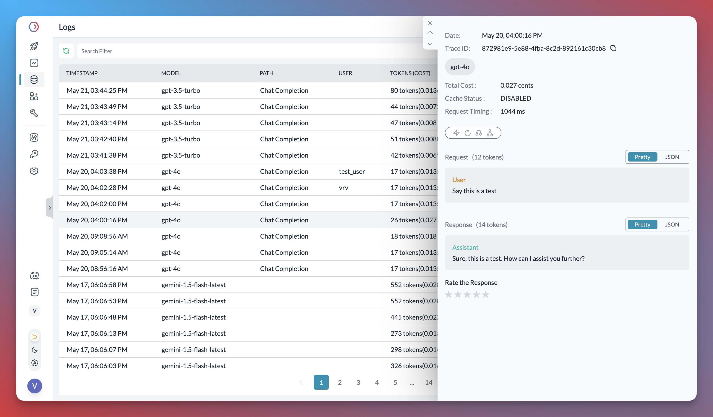

# Automatically retry requests to LLMs

A sudden timeout or error could harm the user experience and hurt your service's reputation if your application relies on an LLM for a critical feature. To prevent this, it's crucial to have a reliable retry mechanism in place. This will ensure that users are not left frustrated and can depend on your service.

Retrying Requests to Large Langauge Models (LLMs) can significantly increase your Gen AI app's reliability.

It can help you handle cases such as:

1. Cases that timed out (no response from the model)
2. Cases that returned a transient error from the model

In this cookbook, you will learn to use Portkey to automatically retry the requests on specific response status codes and control the times you want to retry.

## 1. Import and Authenticate Portkey Client SDK

Portkey forwards your requests to your desired model and relays the response to your app. Portkey’s Client SDK is one of several ways to make those API calls through the AI gateway.

To install it, type the following in your NodeJS environment:

```sh
npm install portkey-ai
```

Import `Portkey` and instantiate it using the Portkey API Key

```js
const portkey = new Portkey({
  apiKey: 'xxxxrk',
  virtualKey: 'maixxx4d'
});
```

At this point, it’s essential to understand that you instantiate the `portkey` instance with `apiKey` and `virtualKey` parameters. You can find the arguments for both of them in your Portkey Dashboard.

Visit the reference to [obtain the Portkey API key](https://portkey.ai/docs/api-reference/authentication) and learn [how to create Virtual Keys](https://portkey.ai/docs/product/ai-gateway-streamline-llm-integrations/virtual-keys#creating-virtual-keys).

## 2. Gateway Configs to Automatically Retry

For the AI gateway to understand that you want to apply automatic retries to your requests, you must pass Gateway Configs in your request payload. Gateway Configs can be a JS Object or a JSON string.

A typical Gateway Config to automatically retry three times when you hit rate-limits:

```js
{
   retry: {
      attempts: 3,
      on_status_codes: [429]
    }
}
```

You created a `retry` object with `attempts` and `on_status_codes` keys. The value of `attempts` can be bumped up to `5` times to retry automatically, while `on_status_codes` is an optional key. By default, Portkey will attempt to retry on the status codes `[429, 500, 502, 503, 504]`.

Refer to the [101 on Gateway Configs](https://github.com/Portkey-AI/portkey-cookbook/blob/main/ai-gateway/101-portkey-gateway-configs.md#a-reference-gateway-configs-from-the-ui) and [Automatic Retries](https://portkey.ai/docs/product/ai-gateway-streamline-llm-integrations/automatic-retries).

## 3. Make API calls using Portkey Client SDK

You are now ready to make an API call through Portkey. While there are several ways to make API calls, in this cookbook, let’s pass the gateway configuration during the chat completion call.

```js
let response = await portkey.chat.completions.create(
  {
    model: 'gpt-4',
    messages: [
      {
        role: 'user',
        content: 'What are 7 wonders of the world?'
      }
    ]
  },
  {
    config: JSON.stringify({
      retry: {
        attempts: 3,
        on_status_codes: [429]
      }
    })
  }
);

console.log(response.choices[0].message.content);
```

The Portkey SDK adds the configs in the HTTP headers to apply automatic retries to our requests. Broadly, the signature of the chat completion method:

```js
await portkey.chat.completions.create( modelParmeters [, gatewayConfigs])
```

## 4. View the Logs

Now that you successfully know how to make API calls through Portkey, it’s also helpful to learn about Logs. You can find all requests sent through Portkey on the **Dashboard** > **Logs** page.


This page provides essential information such as time, cost, and response. Feel free to explore it!

Instead of using your own application-level looping or control structures to implement retries, you can use Portkey’s Gateway Configs to manage all of them.

<details>
<summary>See the full code</summary>

```js
import { Portkey } from 'portkey-ai';

const portkey = new Portkey({
  apiKey: xxxx,
  virtualKey: 'xaixxxxxxx2xx4d'
});

let response = await portkey.chat.completions.create(
  {
    model: 'gpt-4',
    messages: [
      {
        role: 'user',
        content: 'What are 7 wonders of the world?'
      }
    ]
  },
  {
    config: JSON.stringify({
      retry: {
        attempts: 3
      }
    })
  }
);

console.log(response.choices[0].message.content);
```

</details>
